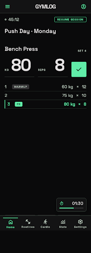
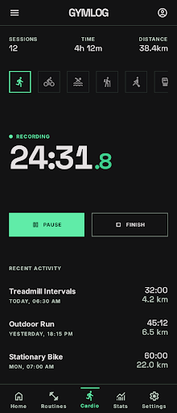
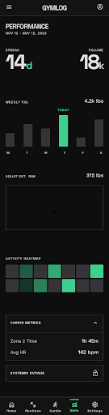
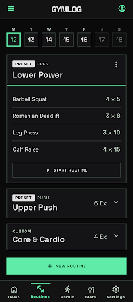
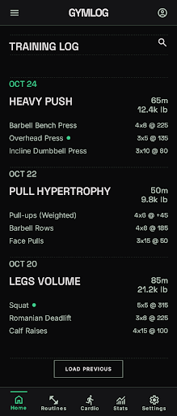
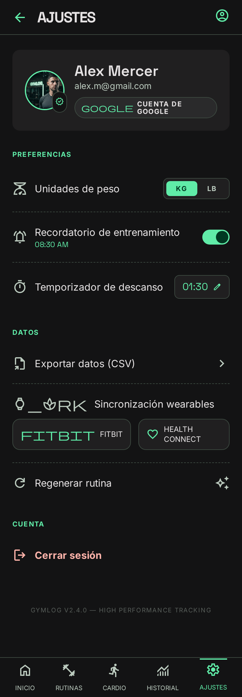
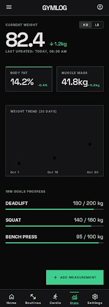
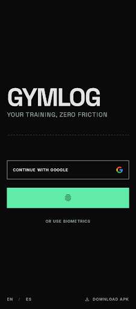

<div align="center">
  

  

  <br>

<a href="https://git.io/typing-svg"></a>

  <p>PWA + app nativa Android/iOS para el registro y análisis de entrenamientos de <b>fuerza</b> y <b>cardio</b>. Diseñada con enfoque <b>offline-first</b>, autenticación con Google, notificaciones inteligentes y experiencia nativa real con Capacitor 8.</p>

  <p>
    <a href="https://app.gymlog.dpdns.org"></a>
    <a href="https://gymlog.dpdns.org"></a>
  </p>

  <p>
    
    
    
    
    
    
  </p>

  <p>
    
    
    
    
    
    
  </p>

  
</div>

---

## Gallery

<div align="center">
  <table>
    <tr>
      <td></td>
      <td></td>
      <td></td>
      <td></td>
    </tr>
    <tr>
      <td align="center"><sub>Workout en vivo</sub></td>
      <td align="center"><sub>Cardio</sub></td>
      <td align="center"><sub>Dashboard</sub></td>
      <td align="center"><sub>Rutinas</sub></td>
    </tr>
    <tr>
      <td></td>
      <td></td>
      <td></td>
      <td></td>
    </tr>
    <tr>
      <td align="center"><sub>Historial</sub></td>
      <td align="center"><sub>Ajustes</sub></td>
      <td align="center"><sub>Mediciones</sub></td>
      <td align="center"><sub>Login</sub></td>
    </tr>
  </table>
</div>

---

<div align="center">
  <table>
    <tr>
      <td></td>
      <td></td>
      <td></td>
      <td></td>
      <td></td>
      <td></td>
      <td></td>
      <td></td>
    </tr>
  </table>
</div>

---

## Core Features

<table>
  <tr>
    <td align="center" width="50%"><b>Registro de Fuerza</b>
      <p>Series con peso × reps, validación Zod, detección automática de PRs con Brzycki, confetti, temporizador de descanso con alarma y referencia de sesión anterior.</p>
    </td>
    <td align="center" width="50%"><b>Módulo Cardio</b>
      <p>Cronómetro en vivo con pausa/reanudar para 8 tipos de actividad, registro de distancia, calorías y notas. Estadísticas semanales.</p>
    </td>
  </tr>
  <tr>
    <td align="center" width="50%"><b>Analíticas Premium</b>
      <p>Dashboard con KPIs, gráficos de volumen semanal, distribución muscular, progresión por ejercicio, análisis de fatiga neuromuscular y calculadora 1RM.</p>
    </td>
    <td align="center" width="50%"><b>Experiencia Nativa</b>
      <p>Edge-to-Edge, haptics, biometría (Face ID / huella), deep links, notificaciones push y locales, compartir entrenamientos, multiidioma ES/EN.</p>
    </td>
  </tr>
  <tr>
    <td align="center" width="50%"><b>Rutinas Semanales</b>
      <p>Planes predefinidos (PPL, Full Body...) y rutinas personalizadas. Planificación diaria L-D con sugerencia automática de ejercicios del día.</p>
    </td>
    <td align="center" width="50%"><b>Offline-First</b>
      <p>Outbox en IndexedDB con reintentos + descarte inteligente. Caché de queries persistida. La app funciona sin conexión y sincroniza al recuperar red.</p>
    </td>
  </tr>
  <tr>
    <td align="center" width="50%"><b>Wearables</b>
      <p>Integración con Health Connect / HealthKit vía plugin Capacitor propio HealthBridge. Pasos, FC, sueño, workouts de cualquier dispositivo.</p>
    </td>
    <td align="center" width="50%"><b>Export / Import Excel</b>
      <p>Libro .xlsx de 3 hojas con round-trip sin pérdida. Importa tanto formato exportado como hojas hechas a mano.</p>
    </td>
  </tr>
</table>

---

## Quick Start

<div align="center">
  
</div>

### 1. Dev

```bash
npm install
npm run dev              # http://localhost:5173
```

### 2. Verify

```bash
npm run lint             # ESLint
npm run type-check       # tsc --noEmit
npm run test             # 153 tests (Vitest)
```

### 3. Build

```bash
npm run build            # tsc -b + vite build → dist/
npm run build:android    # + cap sync android
npm run apk              # Build + APK firmado
```

### 4. Env

```bash
VITE_SUPABASE_URL=<url>
VITE_SUPABASE_KEY=<anon-key>
VITE_SENTRY_DSN=<dsn>    # opcional
```

Crear `.env.local`. Sin Supabase → pantalla negra.

---

## Project Activity

<div align="center">
  
</div>

---

## Stack Tecnológico

| Capa               | Tecnología               | Función                                                                         |
| :----------------- | :----------------------- | :------------------------------------------------------------------------------ |
| **Mobile Runtime** | Capacitor 8              | Puente nativo: haptics, biometría, notificaciones, deep links, share            |
| **Frontend**       | React 19, TypeScript 5.7 | UI reactiva con lazy loading y transiciones animadas (Framer Motion)            |
| **Estilos**        | Tailwind CSS 4           | Sistema de diseño con design tokens y responsive                                |
| **Data Flow**      | TanStack Query v5        | Estado del servidor, caché, invalidación y sincronización con Supabase          |
| **Global Store**   | Zustand 5                | Estado local persistido: workout activo, rutinas, cardio, ajustes               |
| **Gráficos**       | Recharts 3               | Volumen semanal, distribución muscular, progresión por ejercicio                |
| **Validación**     | Zod 3                    | Validación de series (reps/peso) con mensajes tipados                           |
| **i18n**           | i18next + react-i18next  | Multiidioma ES/EN con detección automática y persistencia                       |
| **Backend**        | Supabase                 | PostgreSQL, Auth (Google OAuth), RLS, tipos auto-generados                      |
| **PWA**            | vite-plugin-pwa          | Service worker, instalable, offline-first, prompt de actualización in-app       |
| **Persistencia**   | TanStack Persist + idb   | Caché de queries en IndexedDB para arranque sin red                             |
| **Drag & Drop**    | dnd-kit                  | Reordenar ejercicios de rutina por arrastre                                     |
| **Errores**        | Sentry                   | Captura y reporte de errores en producción                                      |
| **Wearables**      | HealthBridge (nativo)    | Plugin Capacitor propio — Health Connect + HealthKit                            |
| **Excel**          | exceljs                  | Export/import .xlsx de fuerza, cardio y rutinas (carga diferida)                |
| **Testing**        | Vitest + Playwright      | Tests unitarios colocalizados + E2E mobile-first                                |
| **CI/CD**          | GitHub Actions           | Lint/tests (`ci.yml`), APK Android (`android-build.yml`), iOS (`ios-build.yml`) |
| **Bundler**        | Vite 6                   | Dev server HMR + build optimizado con chunk splitting                           |

---

## Funcionalidades Detalladas

### 🏋️ Workout — Registro en Vivo

- **Selector de ejercicios** con buscador, filtros por grupo muscular y equipamiento
- **Ejercicios personalizados**: crea los tuyos propios además del catálogo predefinido
- **Series**: peso × reps con validación en tiempo real (Zod)
- **Series de calentamiento**: toggle para marcar warmup sets (no cuentan en volumen)
- **Detección automática de PRs**: calcula 1RM con Brzycki → confetti + vibración
- **Temporizador de descanso**: cronómetro configurable con alarma sonora + notificación nativa
- **Auto-inicio de descanso**: el timer arranca solo al añadir una serie (configurable)
- **Referencia de última sesión**: muestra las series anteriores del mismo ejercicio
- **Notas por ejercicio**: CRUD de notas técnicas asociadas a cada ejercicio
- **Persistencia de sesión**: retoma el entrenamiento hasta 12h después si cierras la app
- **Compartir entrenamiento**: resumen vía Web Share API o clipboard
- **Rutina del día**: muestra automáticamente los ejercicios programados

### 🏃 Cardio — Cronómetro en Vivo

- **8 tipos de actividad**: running, cycling, walking, rowing, swimming, elliptical, jump rope, other
- **Cronómetro** con pausa / reanudar / terminar
- **Datos opcionales**: distancia (km), calorías y notas
- **Estadísticas semanales**: sesiones, tiempo total y distancia
- **Historial** con eliminación individual
- **Sincronización** bidireccional con Supabase

### 📊 Estadísticas — Dashboard Analítico

- **KPIs**: racha actual/máxima, volumen semanal (tendencia %), frecuencia (30d), duración media
- **KPIs secundarios**: volumen total, mejor 1RM, PRs totales, notas de series
- **Volumen semanal**: gráfico por período (4sem / 3mes / 6mes / 1año), vista bar o area
- **Distribución muscular**: gráfico de volumen por grupo muscular
- **Progresión por ejercicio**: evolución temporal por métrica (1RM / peso máx / volumen)
- **Análisis de fatiga**: recuperación por grupo muscular + sugerencia de qué entrenar
- **Sección cardio**: KPIs + breakdown por tipo de actividad con barras animadas
- **Calculadora 1RM**: repetición máxima estimada (Brzycki)

### 📗 Historial — Export / Import

- **Exportar Excel (.xlsx)**: 3 hojas — Entrenamientos (grid secciones × fecha), Cardio, Rutinas
- **Exportar JSON**: backup completo
- **Importar Excel**: acepta exportado y hojas manuales (texto libre en pesos, round-trip verificado)
- **Importar CSV / JSON**: formato legacy
- **Web = app**: en nativo se comparte (Share), en web se descarga (Blob)

### 📅 Rutinas — Planificación Semanal

- **Predefinidas**: Push/Pull/Legs, Full Body, etc.
- **Personalizadas**: CRUD completo
- **Planificación diaria** (L-D) con series × reps sugeridos
- **Vista "hoy"**: destaca los ejercicios del día actual
- **Backup automático** y persistencia en Supabase

### ⌚ Wearables — Dispositivos de Salud

- **Health Connect (Android) / HealthKit (iOS)**: plugin Capacitor propio HealthBridge
- **Datos**: pasos, distancia, calorías, FC (media/máx/reposo), sueño por fases, workouts
- **Sync al abrir** configurable + botón manual en `/wearables`

### 🔐 Autenticación y Seguridad

- **Google OAuth** vía Supabase Auth
- **Deep Links**: `com.franvi.gymlog://auth/callback`
- **Onboarding**: objetivo de entrenamiento y días/semana al primer login
- **Acceso biométrico**: huella / Face ID (plugin Capacitor custom)
- **Row Level Security** en todas las tablas

### ⚙️ Ajustes

- **Idioma**: ES/EN con persistencia
- **Unidad de peso**: kg / lb con conversión automática
- **Sonido**: feedback on/off
- **Notificaciones push**: nativas + web (Service Worker)
- **Recordatorios**: aviso si 2+ días sin entrenar
- **Calentamiento**: toggle global warmup sets
- **Auto-descanso**: timer automático al añadir serie
- **Biometría**: activar/desactivar
- **Descarga APK**: botón directo en web

---

## Notificaciones

| Tipo                  | Cuándo                      | Contenido                       |
| :-------------------- | :-------------------------- | :------------------------------ |
| **Resumen semanal**   | Lunes 9:00                  | "X sesiones · Y kg · Z récords" |
| **Racha en riesgo**   | Racha ≥3d y hoy sin entreno | Aviso para no perder la racha   |
| **Alarma descanso**   | Timer termina               | Notificación + sonido           |
| **Recordatorio**      | 2+ días sin entrenar        | Motivación                      |
| **Actualización PWA** | Nueva versión               | Toast "Actualizar"              |

---

## Arquitectura

Organización vertical en **feature slices**. Cada dominio es autocontenido. Lo compartido va por `@shared/`.

```
src/
├── app/                      # Wiring global
│   ├── components/           #   Layout, PermissionRequests
│   ├── providers.tsx         #   App providers (QueryClient, Toaster)
│   ├── queryClient.ts        #   TanStack Query config
│   └── queryPersister.ts     #   IDB persister
├── features/                 # Dominios autocontenidos
│   ├── auth/                 # Google OAuth, onboarding, settings, biometría
│   │   ├── components/       #   OnboardingModal
│   │   ├── hooks/            #   useProfile
│   │   ├── pages/            #   AuthPage, AuthCallback, SettingsPage
│   │   └── stores/           #   authStore
│   ├── cardio/               # Cronómetro, historial, estadísticas
│   │   ├── components/       #   ActiveSessionCard, WeeklyStats, SessionHistoryItem
│   │   ├── pages/            #   CardioPage
│   │   └── stores/           #   cardioStore
│   ├── routine/              # Rutinas semanales
│   │   ├── components/       #   SortableExerciseList
│   │   ├── hooks/            #   useWorkoutReminder
│   │   ├── pages/            #   RoutinePage
│   │   └── stores/           #   routineStore
│   ├── stats/                # Dashboard analítico
│   │   ├── components/       #   Charts, KPICards, HistoryRows, FatigueAnalysis, userStats/
│   │   ├── hooks/            #   useFatigueSuggestion
│   │   ├── pages/            #   StatsPage, HistoryPage, UserStatsPage
│   │   └── utils/            #   kpiCalculations, statsData, tips, historyHelpers, ...tests/
│   ├── wearables/            # Health Connect / HealthKit
│   │   ├── api/              #   healthAggregator, wearablesQueries
│   │   ├── components/       #   ConnectionCard, SleepCard, WearablesSummary
│   │   ├── hooks/            #   useWearableConnections, useWearableSync
│   │   ├── pages/            #   WearablesPage
│   │   ├── stores/           #   wearableStore
│   │   └── types/
│   └── workout/              # Registro de fuerza
│       ├── api/              #   workoutMutations
│       ├── components/       #   ExerciseSelector, RestTimer, WorkoutSetList, PlatesCalculator...
│       ├── hooks/            #   useExerciseSearch
│       ├── pages/            #   WorkoutPage, ExerciseLibraryPage
│       ├── stores/           #   workoutStore, restTimerStore
│       └── types/
├── shared/                   # Infraestructura compartida
│   ├── api/                  #   queries.ts
│   ├── components/           #   ErrorBoundary, EmptyStates, SwipeToDelete, icons, ui/
│   │   └── ui/               #   Button, Input, Modal, Skeleton, Badge, BottomSheet...
│   ├── constants/            #   muscleColors
│   ├── hooks/                #   useWeight, useWakeLock, useRateLimit, useBackgroundNotifications
│   ├── lib/                  #   brzycki, supabase, i18n, duration, formatDate, haptics...
│   ├── stores/               #   settingsStore, outboxStore
│   └── styles/               #   tokens.css
├── types/                    # database.types.ts (auto-generado por Supabase)
└── assets/                   # hero.png
```

### Aliases

| Alias       | Ruta             |
| :---------- | :--------------- |
| `@`         | `./src`          |
| `@features` | `./src/features` |
| `@shared`   | `./src/shared`   |
| `@app`      | `./src/app`      |

Definidos en `vite.aliases.ts` y sincronizados en `tsconfig.app.json`.

### Convenciones

- **i18n**: todo string visible por `useTranslation()` / `t()` — nunca literales
- **Tipos**: `import type` obligatorio, `any` prohibido (ESLint)
- **Barrel files**: solo donde existen (`@shared/components/ui`, `@features/workout/types/`)
- **Lazy loading**: todas las páginas con `lazy()` en `App.tsx`
- **Tests**: Vitest, `__tests__/` colocalizado, `*.test.ts*`, mock con path alias

---

## Modelo de Datos

PostgreSQL (Supabase) con Row Level Security:

| Tabla                  | Descripción                                            |
| :--------------------- | :----------------------------------------------------- |
| `profiles`             | Perfil: nombre, avatar, objetivo, días/semana          |
| `exercises`            | Catálogo: grupo muscular, equipamiento, bilateral      |
| `workouts`             | Sesiones: timestamps, volumen, duración, notas, rating |
| `workout_sets`         | Series: peso, reps, RPE, warmup                        |
| `workout_exercises`    | Relación workout↔exercise                              |
| `personal_records`     | PRs: peso, reps, 1RM, rep band                         |
| `exercise_notes`       | Notas técnicas por ejercicio                           |
| `user_routines`        | Rutinas semanales (JSON)                               |
| `cardio_sessions`      | Cardio: tipo, duración, distancia, calorías            |
| `body_measurements`    | Mediciones: peso, % grasa, masa muscular               |
| `exercise_goals`       | Objetivos de 1RM                                       |
| `routine_templates`    | Plantillas predefinidas                                |
| `push_tokens`          | Tokens FCM                                             |
| `wearable_connections` | Conexiones por proveedor                               |
| `wearable_daily`       | Métricas diarias: pasos, calorías, FC                  |
| `wearable_sleep`       | Sueño por fases                                        |

---

## CI/CD

| Workflow            | Disparo             | Acción                                    |
| :------------------ | :------------------ | :---------------------------------------- |
| `ci.yml`            | push / PR (main)    | lint + type-check + test (Vitest) + build |
| `android-build.yml` | push main / tags v* | build web + cap sync + APK firmado        |
| `ios-build.yml`     | manual / push       | smoke test iOS (macOS runner)             |
| `react-doctor.yml`  | manual              | diagnóstico React                         |

### Utilidades

```bash
npm run gen:types       # regenerar tipos Supabase
npm run analyze         # bundle visualizer
npm run coverage        # tests con cobertura V8
npm run commit          # commit convencional (Commitizen)
npm run release         # release + CHANGELOG (standard-version)
npm run icons           # generar iconos PWA/Android
```

---

## Experiencia Nativa (Capacitor 8)

- **Haptic Feedback**: vibraciones al completar series, guardar y batir PRs
- **Acceso Biométrico**: Face ID (iOS) / huella (Android) — plugin BiometricPlugin propio
- **True Full-Screen**: edge-to-edge con WindowInsets
- **Notificaciones**: locales + push remotas (FCM)
- **Deep Links**: `com.franvi.gymlog://workout/new`, `com.franvi.gymlog://history`
- **Compartir**: resumen vía Web Share API
- **Iconos Adaptativos**: Android 14+, splash screen

### iOS

Código nativo en `ios-custom/`:

- `BiometricPlugin.swift` — Face ID / Touch ID
- `HealthBridgePlugin.swift` — HealthKit
- `Info.plist.patch.sh` — inyecta URL scheme + NSFaceIDUsageDescription
- `add-plugin-to-target.rb` — registra en Xcode

`ios/` es efímero (generado por `npx cap add ios`) y no se versiona.

### APK

Último APK en **[GitHub Releases](https://github.com/Haplee/gymlog/releases/latest)** o desde la [Landing Page](https://gymlog.dpdns.org).

---

## Changelog

### v4.1

- Refactor por features: splits de componentes >800 líneas (CardioPage, UserStatsPage, HistoryPage, StatsPage, WorkoutPage)
- Cardio: componentes extraídos (ActiveSessionCard, WeeklyStats, SessionHistoryItem)
- 153 tests, estructura `__tests__/` colocalizada
- AGENTS.md canónico con reglas de arquitectura

### v3.1 → v4.0

- Overhaul visual Stitch (Swiss-Athletic): tema oscuro único, design tokens, DM Sans + Geist Mono
- Export/Import Excel (.xlsx) round-trip verificado
- Offline-first: outbox IndexedDB con reintentos
- Wearables: Health Connect / HealthKit (plugin HealthBridge)
- Avatares en Supabase Storage, CI iOS

### v3.0

- Notificaciones push remotas (FCM)
- Biblioteca de ejercicios, calculadora de discos
- Medidas corporales, objetivos 1RM
- Reordenar ejercicios (dnd-kit)
- Persistencia de queries (IndexedDB)
- Errores con Sentry

---

<div align="center">
  
</div>

## Autoría

<div align="center">

  

  <br>

  

<br><br>

<a href="https://github.com/Haplee"></a>
<a href="https://x.com/FranVidalMateo"></a>
<a href="https://www.instagram.com/franvidalmateo"></a>

<br><br>
<b>GymLog v4.1</b> — <a href="https://github.com/Haplee">Haplee</a>

</div>
