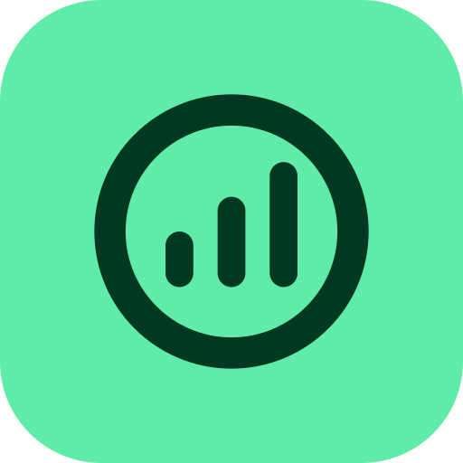
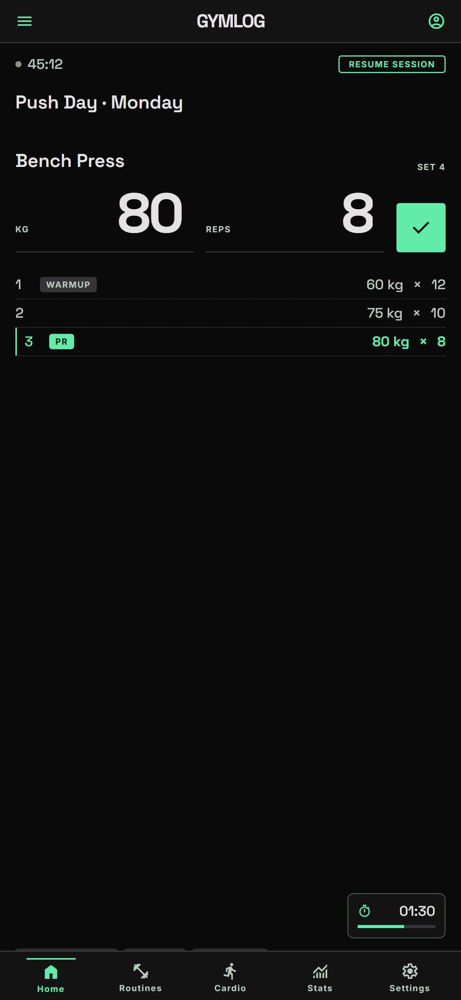
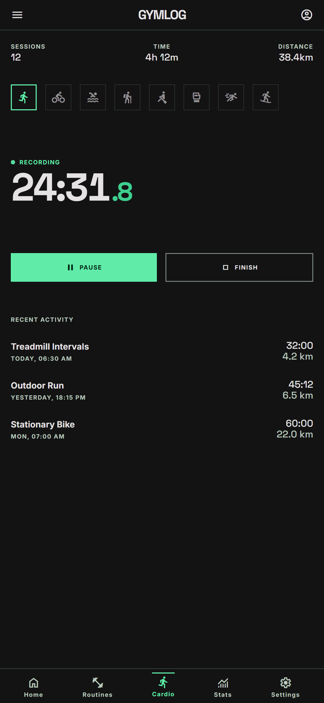
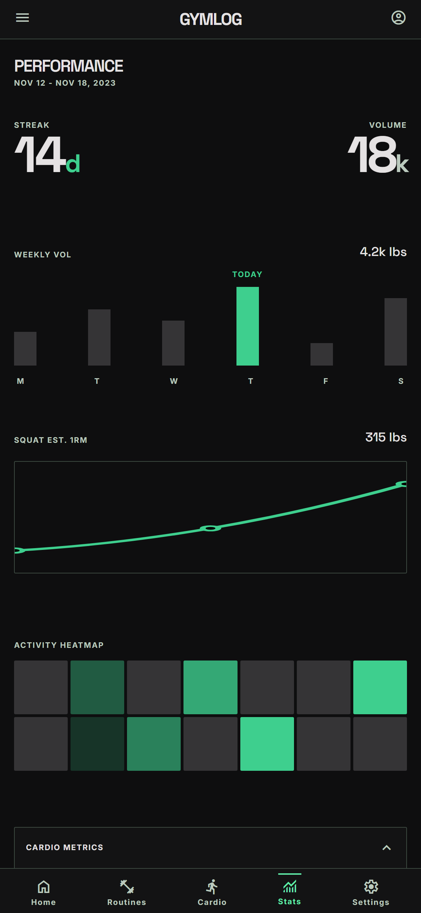
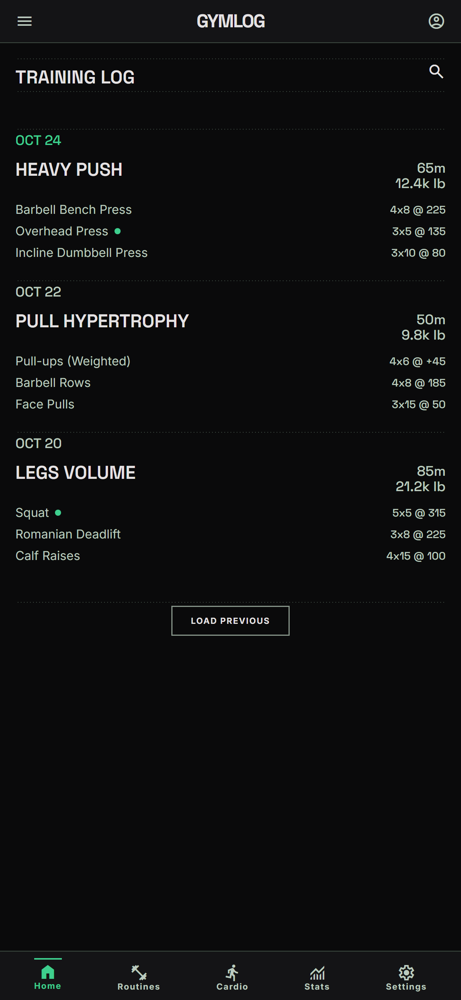

<div align="center">
  

  

  <br>

<a href="https://git.io/typing-svg"></a>

  <p>PWA + app nativa Android/iOS para el registro y análisis de entrenamientos de <b>fuerza</b> y <b>cardio</b>. Diseñada con enfoque <b>offline-first</b>, autenticación con Google, notificaciones inteligentes y experiencia nativa real con Capacitor 8.</p>

  <p>
    <a href="https://app.gymlog.dpdns.org"></a>
    <a href="https://gymlog.dpdns.org/download/gymlog.apk"></a>
  </p>

  <p>
    
    
    
    
    
    
  </p>

  <p>
    
    
    
    
    
    
    
  </p>

  
</div>

---

## Gallery

<div align="center">
  <table>
    <tr>
      <td></td>
      <td></td>
      <td></td>
      <td></td>
    </tr>
    <tr>
      <td align="center"><sub>Workout en vivo</sub></td>
      <td align="center"><sub>Cardio</sub></td>
      <td align="center"><sub>Dashboard</sub></td>
      <td align="center"><sub>Historial</sub></td>
    </tr>
  </table>
</div>

---

<div align="center">
  <table>
    <tr>
      <td></td>
      <td></td>
      <td></td>
      <td></td>
      <td></td>
      <td></td>
      <td></td>
      <td></td>
    </tr>
  </table>
</div>

---

## Core Features

<table>
  <tr>
    <td align="center" width="50%"><b>Registro de Fuerza</b>
      <p>Series con peso × reps, validación Zod, detección automática de PRs con Brzycki, confetti, temporizador de descanso con alarma y referencia de sesión anterior.</p>
    </td>
    <td align="center" width="50%"><b>Módulo Cardio</b>
      <p>Cronómetro en vivo con pausa/reanudar para 8 tipos de actividad, registro de distancia, calorías y notas. Estadísticas semanales.</p>
    </td>
  </tr>
  <tr>
    <td align="center" width="50%"><b>Analíticas Premium</b>
      <p>Dashboard con KPIs, gráficos de volumen semanal, distribución muscular, progresión por ejercicio, análisis de fatiga neuromuscular y calculadora 1RM.</p>
    </td>
    <td align="center" width="50%"><b>Experiencia Nativa</b>
      <p>Edge-to-Edge, haptics, biometría (Face ID / huella), deep links, notificaciones push y locales, compartir entrenamientos, multiidioma ES/EN.</p>
    </td>
  </tr>
  <tr>
    <td align="center" width="50%"><b>Entrenador IA (opt-in)</b>
      <p>Apagado por defecto. Sugiere carga y ajustes, pero <b>nunca modifica nada</b>: propone y tú aplicas. La clave del proveedor vive solo en el servidor.</p>
    </td>
    <td align="center" width="50%"><b>Autorregulación sin IA</b>
      <p>Motor determinista por RIR/RPE que calcula la carga siguiente <b>en el dispositivo</b>, sin red y con el entrenador IA apagado.</p>
    </td>
  </tr>
  <tr>
    <td align="center" width="50%"><b>Rutinas Semanales</b>
      <p>Planes predefinidos (PPL, Full Body...) y rutinas personalizadas. Planificación diaria L-D con sugerencia automática de ejercicios del día.</p>
    </td>
    <td align="center" width="50%"><b>Offline-First</b>
      <p>Outbox en IndexedDB con reintentos + descarte inteligente. Caché de queries persistida. La app funciona sin conexión y sincroniza al recuperar red.</p>
    </td>
  </tr>
  <tr>
    <td align="center" width="50%"><b>Wearables</b>
      <p>Integración con Health Connect / HealthKit vía plugin Capacitor propio HealthBridge. Pasos, FC, sueño, workouts de cualquier dispositivo.</p>
    </td>
    <td align="center" width="50%"><b>Export / Import Excel</b>
      <p>Libro .xlsx de 3 hojas con round-trip sin pérdida. Importa tanto formato exportado como hojas hechas a mano.</p>
    </td>
  </tr>
</table>

---

## Quick Start

<div align="center">
  
</div>

### 1. Dev

```bash
npm install
npm run dev              # http://localhost:5173
```

### 2. Verify

```bash
npm run lint             # ESLint
npm run type-check       # tsc -b --force
npm run test             # 577 tests en 57 ficheros (Vitest)
npx playwright test      # 52 E2E (e2e/) — requiere E2E_EMAIL/E2E_PASSWORD para los autenticados
```

El flujo E2E **con sesión iniciada** (`e2e/workout-session.spec.ts`) se salta si no
encuentra credenciales, para que CI siga en verde sin secretos. Para ejecutarlo,
pon en `.env.local` una cuenta **desechable** (el test escribe un entreno real):

```bash
E2E_EMAIL=cuenta-de-pruebas@ejemplo.com
E2E_PASSWORD=...
```

Ya hay una cuenta creada para esto, con ~10 semanas de historial sembrado (30
entrenos, 270 series, rutina activa, cardio y medidas), para que las pantallas de
estadísticas e historial no salgan vacías al auditar la UI. Sus credenciales viven
solo en `.env.local`. Si hay que recrearla o resembrar sus datos:
`scripts/seed-e2e-user.sql` documenta el proceso completo, incluida la limpieza.

### 3. Build

```bash
npm run build            # tsc -b + vite build → dist/
npm run build:android    # + cap sync android
npm run apk              # build:android + APK firmado
```

### 4. Env

```bash
VITE_SUPABASE_URL=<url>
VITE_SUPABASE_KEY=<anon-key>
VITE_SENTRY_DSN=<dsn>                     # opcional
VITE_CLOUDFLARE_ANALYTICS_TOKEN=<token>   # opcional, solo web
```

Crear `.env.local`. Sin Supabase → pantalla negra.

> La clave del proveedor de IA **no es una variable `VITE_*`**: viviría en el cliente y por tanto sería pública. Va en los secretos de la Edge Function (`supabase secrets set`), como se detalla en la sección del entrenador IA.

---

## Project Activity

<div align="center">
  
</div>

---

## Stack Tecnológico

| Capa               | Tecnología                 | Función                                                                        |
| :----------------- | :------------------------- | :----------------------------------------------------------------------------- |
| **Mobile Runtime** | Capacitor 8.3              | Puente nativo: haptics, biometría, notificaciones, deep links, share           |
| **Frontend**       | React 19.2, TypeScript 5.7 | UI reactiva con lazy loading y transiciones animadas                           |
| **Routing**        | React Router 8             | Rutas con `lazy()` y tabla de rutas cubierta por tests                         |
| **Estilos**        | Tailwind CSS 4.2           | CSS-first vía `@tailwindcss/vite`: **no hay `tailwind.config.js`**             |
| **Animaciones**    | Framer Motion 12           | `LazyMotion` + `MotionConfig reducedMotion="user"` (respeta ahorro de energía) |
| **Data Flow**      | TanStack Query 5           | Estado del servidor, caché, invalidación y sincronización con Supabase         |
| **Global Store**   | Zustand 5                  | Estado local persistido: workout activo, rutinas, cardio, ajustes              |
| **Gráficos**       | Recharts 3                 | Volumen semanal, distribución muscular, progresión por ejercicio               |
| **Iconos**         | reicon-react               | Set generalista + `Icon*` propios de dominio, tras un único barril             |
| **Virtualización** | TanStack Virtual 3         | Biblioteca de ejercicios sin montar la lista entera                            |
| **Validación**     | Zod 3                      | Validación de series (reps/peso) con mensajes tipados                          |
| **i18n**           | i18next 24 + react-i18next | Multiidioma ES/EN con detección automática y persistencia                      |
| **Backend**        | Supabase                   | PostgreSQL, Auth (Google OAuth), RLS, RPC, tipos auto-generados                |
| **Edge Functions** | Deno (Supabase)            | `ai-coach` (entrenador IA) y `send-push` (notificaciones remotas)              |
| **PWA**            | vite-plugin-pwa            | Service worker, instalable, offline-first, prompt de actualización in-app      |
| **Persistencia**   | TanStack Persist + idb     | Caché de queries en IndexedDB, con escrituras agrupadas (`PersistGate`)        |
| **Drag & Drop**    | dnd-kit                    | Reordenar ejercicios de rutina por arrastre                                    |
| **Errores**        | Sentry (@sentry/capacitor) | Captura de errores de webview **y** crashes nativos                            |
| **Wearables**      | HealthBridge (nativo)      | Plugin Capacitor propio — Health Connect + HealthKit                           |
| **Excel**          | exceljs                    | Export/import .xlsx de fuerza, cardio y rutinas (carga diferida)               |
| **Testing**        | Vitest 4 + Playwright      | Tests unitarios colocalizados + E2E mobile-first                               |
| **CI/CD**          | GitHub Actions             | 6 workflows: CI, APK, iOS (smoke y firmado), landing, diagnóstico              |
| **Bundler**        | Vite 6                     | Dev server HMR + build optimizado con chunk splitting                          |

---

## Sistema de Diseño

Reskin **FitBody** (julio 2026) + material **Liquid Glass** (agosto 2026). Antes era el sistema «Stitch» de acento menta; las capturas y documentos que se vean en verde son de esa etapa.

| Token             | Valor                                                                 |
| :---------------- | :-------------------------------------------------------------------- |
| Acento            | `#ffd93d` (amarillo lima) **por defecto** — el usuario elige entre 24 |
| Base / superficie | `#0a0a0b` / `#26262b`                                                 |
| Tipografía        | **Inter** (cuerpo) + **Space Grotesk** (display y cifras tabulares)   |
| Material          | 3 capas: `glass-1` contenido · `glass-2` elevado · `glass-3` flotante |

### Liquid Glass

Un vidrio no se reconoce porque deje ver lo que hay detrás, sino por **cómo le da la luz**: canto luminoso arriba, caída de luz hacia abajo y un borde que define sin encerrar. Lo de «ver a través» resulta ser la parte cara y la prescindible.

- **La capa se elige por función, nunca por aspecto**, y no se anidan capas del mismo nivel. Una tarjeta dentro de otra idéntica es señal de que la jerarquía está mal, no de que falte una capa.
- **Sin `backdrop-filter`**, y por dos medidas, no por gusto. Con el acento pasando por debajo, ningún velo translúcido alcanza AA a ninguna opacidad — es aritmética de composición alpha, no algo ajustable. Y el blur ya se midió en julio y se quitó por jank en el WebView de Android. La señal de «hay algo pasando por debajo» la da el **difuminado de borde de scroll**, que se pinta una vez en vez de remuestrear el fondo en cada frame.
- **La luz se gasta en el canto, no en el área.** Aclarar 1 px de borde no toca el contraste del texto; aclarar toda la superficie sí, y con los 24 acentos rompe el AA.
- **Lo que tapa contenido no puede ser translúcido**, aunque sea capa 3. El 4 % de `glass-3` está pensado para chrome delgado —una barra de 56 px sobre contenido que se desplaza—, donde solo deja intuir que hay algo debajo. En un panel del 80 % de ancho y alto completo ese mismo 4 % deja **leer** lo de detrás: el cajón de navegación enseñaba el titular de la portada por debajo del menú. Para esos casos está `glass-solid`, que conserva canto, brillo y sombra y solo quita el alpha. Los modales no lo necesitan: con su velo al 60 % detrás, el residuo cae por debajo de lo representable en 8 bits (medido: banda vacía con amplitud 0).
- Medido en una Galaxy Tab A7 (Android 12, gama media-baja de 2020): **1 frame con jank de 384, p99 11 ms**.

**Modo claro completo**: Ajustes → Preferencias → Tema (OSCURO / CLARO). Vive en `settingsStore.theme` + el bloque `:root.light` de `tokens.css`, y es independiente del tema del sistema.

**Acentos configurables**: 24 presets en `@shared/constants/accents.ts`, cada uno con su pareja clara y oscura — en claro el acento tiene que ser oscuro porque también se usa como color de texto sobre blanco. En Android el icono del lanzador sigue al acento elegido.

**Iconos**: todo pasa por `@shared/components/icons`. Ningún componente importa de la librería directamente, que es lo que convierte «cambiar de librería de iconos» en tocar un fichero y no 68.

La fuente única de los tokens es `src/shared/styles/tokens.css`; `src/index.css` los mapea a utilidades Tailwind con `@theme inline`. **Nunca se hardcodean colores hex en componentes** — las excepciones son los ficheros de paleta (`features/stats/constants.ts`, porque Recharts no resuelve `var()` en `fill` SVG de forma fiable, y `@shared/constants/`) y el logotipo de Google, que son colores de marca de un tercero.

Diseño completo y mediciones: `openspec/changes/liquid-glass-design-system/design.md`.

---

## Funcionalidades Detalladas

### 🏋️ Workout — Registro en Vivo

- **Selector de ejercicios** con buscador, filtros por grupo muscular y equipamiento
- **Ejercicios personalizados** y **favoritos** además del catálogo predefinido
- **Series**: peso × reps con validación en tiempo real (Zod)
- **Tipos de serie**: normal, dropset, rest-pause, AMRAP, y RPE por serie
- **Series de calentamiento**: toggle para marcar warmup sets (no cuentan en volumen)
- **Modalidad de carga**: peso corporal / carga externa / asistida, con el volumen calculado en consecuencia
- **Detección automática de PRs**: calcula 1RM con Brzycki → confetti + vibración
- **PRs por banda de reps**: no solo el 1RM global
- **Temporizador de descanso**: cronómetro configurable con alarma en bucle + notificación nativa
- **Auto-inicio de descanso**: arranca al añadir serie; los compuestos descansan ≈2× (configurable)
- **Referencia de última sesión** con opción de copiar las series
- **Calculadora de discos** a partir del peso objetivo
- **Notas por ejercicio** y notas + valoración de la sesión
- **Persistencia de sesión**: retoma el entrenamiento hasta 12h después si cierras la app
- **Rutina del día**: muestra automáticamente los ejercicios programados

### 🤖 Entrenador IA — opt-in y auditable

Es la parte con más reglas duras del proyecto, a propósito:

- **Apagado por defecto** (`profiles.ai_coach_enabled`). El servidor es la fuente de verdad; el store del cliente es un espejo.
- **El coach propone, tú aplicas**: nada modifica rutinas, pesos ni series sin confirmación explícita.
- **La clave del proveedor nunca llega al cliente**: vive solo en `Deno.env` de la Edge Function `ai-coach`, que verifica el JWT y saca el `user_id` del token, nunca del cuerpo de la petición.
- **Post-filtro determinista** (`supabase/functions/ai-coach/safety.ts`): se midió que no basta con pedírselo al modelo en el prompt.
- **Memoria visible y editable** en `/coach/memory`, con cuota y auditoría en BD (`ai_coach_usage`, `ai_coach_audit`).
- **Capa 0 sin IA** (`features/stats/utils/autoregulation.ts`): motor determinista de autorregulación por RIR/RPE que no manda nada fuera del dispositivo y sigue funcionando con el entrenador apagado.

### 🏃 Cardio — Cronómetro en Vivo

- **8 tipos de actividad**: running, cycling, walking, rowing, swimming, elliptical, jump rope, other
- **Cronómetro** con pausa / reanudar / terminar
- **Datos opcionales**: distancia (km), calorías y notas
- **Estadísticas semanales**: sesiones, tiempo total y distancia
- **Historial** con eliminación individual
- **Sincronización** bidireccional con Supabase (sin resucitar lo borrado en otro dispositivo)

### 📊 Estadísticas — Dashboard Analítico

- **KPIs**: racha actual/máxima, volumen semanal (tendencia %), frecuencia (30d), duración media
- **KPIs secundarios**: volumen total, mejor 1RM, PRs totales, notas de series
- **Volumen semanal**: gráfico por período (4sem / 3mes / 6mes / 1año), vista bar o area
- **Distribución muscular**: volumen por grupo muscular
- **Progresión por ejercicio**: evolución temporal por métrica (1RM / peso máx / volumen)
- **Análisis de fatiga**: recuperación por grupo muscular + sugerencia de qué entrenar
- **Sección cardio**: KPIs + breakdown por tipo de actividad con barras animadas
- **Calculadora 1RM** (Brzycki) y **mediciones corporales** en `/user-stats`

### 📗 Historial — Export / Import

- **Exportar Excel (.xlsx)**: 3 hojas — Entrenamientos (grid secciones × fecha), Cardio, Rutinas
- **Exportar JSON**: backup completo
- **Importar Excel**: acepta exportado y hojas manuales (texto libre en pesos, round-trip verificado)
- **Importar CSV / JSON**: formato legacy
- **Web = app**: en nativo se comparte (Share), en web se descarga (Blob)

### 📅 Rutinas — Planificación Semanal

- **Predefinidas**: Push/Pull/Legs, Full Body, etc.
- **Personalizadas**: CRUD completo
- **Planificación diaria** (L-D) con series × reps sugeridos
- **Vista "hoy"**: destaca los ejercicios del día actual
- **Backup automático** y persistencia en Supabase

### ⌚ Wearables — Dispositivos de Salud

- **Health Connect (Android) / HealthKit (iOS)**: plugin Capacitor propio HealthBridge
- **Datos**: pasos, distancia, calorías, FC (media/máx/reposo), sueño por fases, workouts
- **Sync al abrir** configurable, resync al volver a primer plano (estrangulado a 15 min) y botón manual en `/wearables`
- **Solo en la app nativa**: la lectura de salud no existe en el navegador

### 🔐 Autenticación y Seguridad

- **Google OAuth** vía Supabase Auth
- **Deep Links**: `com.franvi.gymlog://auth/callback`
- **Onboarding**: objetivo de entrenamiento y días/semana al primer login
- **Acceso biométrico**: huella / Face ID (plugin Capacitor propio)
- **Row Level Security** en todas las tablas
- **Guardia de secretos en el bundle**: `npm run check:secrets` inspecciona `dist/`

### ⚙️ Ajustes

- **Tema**: oscuro / claro · **Color de acento** configurable · **Icono de app** (Android)
- **Idioma**: ES/EN con persistencia
- **Unidad de peso**: kg / lb con conversión automática
- **Sonido**: feedback on/off · **Notificaciones** push nativas + web
- **Recordatorios** de entrenamiento y aviso de racha en riesgo
- **Calentamiento**, **auto-descanso** y **descanso por ejercicio**
- **Biometría**, **entrenador IA** y **descarga de APK** (en web)

---

## Notificaciones

| Tipo                  | Cuándo                      | Contenido                       |
| :-------------------- | :-------------------------- | :------------------------------ |
| **Resumen semanal**   | Lunes 9:00                  | "X sesiones · Y kg · Z récords" |
| **Racha en riesgo**   | Racha ≥3d y hoy sin entreno | Aviso para no perder la racha   |
| **Alarma descanso**   | Timer termina               | Notificación + sonido en bucle  |
| **Recordatorio**      | 2+ días sin entrenar        | Motivación                      |
| **Actualización PWA** | Nueva versión               | Toast "Actualizar"              |

Los recordatorios se **reconcilian** al abrir la app, al volver de segundo plano y tras guardar un entreno: si ya entrenaste hoy, el aviso del día se cancela solo.

---

## Arquitectura

Organización vertical en **feature slices**. Cada dominio es autocontenido. Lo compartido va por `@shared/`.

```
src/
├── app/                      # Wiring global
│   ├── components/           #   Layout, PermissionRequests
│   ├── providers.tsx         #   QueryClientProvider + PersistGate + Toaster
│   ├── persistGate.tsx       #   Restore + guardado agrupado de la caché
│   ├── queryClient.ts        #   TanStack Query config
│   ├── queryPersister.ts     #   Persister IndexedDB
│   └── sessionTasks.ts       #   Registro de tareas de cierre de sesión
├── features/                 # Dominios autocontenidos
│   ├── auth/                 # Google OAuth, onboarding, ajustes, biometría
│   ├── cardio/               # Cronómetro, historial, estadísticas
│   ├── coach/                # Entrenador IA opt-in (api/ components/ pages/ stores/ utils/)
│   ├── fitbody/              # Escaparate del reskin (ruta /fitbody)
│   ├── guide/                # Guía de uso en la app (ruta /guide)
│   ├── routine/              # Rutinas semanales
│   ├── stats/                # Dashboard, historial, mediciones, autorregulación
│   ├── wearables/            # Health Connect / HealthKit
│   └── workout/              # Registro de fuerza
│       └── cada feature: pages/ components/ stores/ hooks/ (y api/, utils/, types/)
├── shared/
│   ├── api/                  #   queries.ts, exerciseMutations
│   ├── components/           #   ErrorBoundary, EmptyStates, SwipeToDelete, fitbody/, icons/, ui/
│   ├── constants/            #   accents, muscleColors, muscleGroups, links
│   ├── hooks/                #   useWeight, useVisibilityPausedInterval, useRateLimit...
│   ├── lib/                  #   brzycki, supabase, i18n, alarm, celebration, throttledStorage...
│   ├── stores/               #   settingsStore, outboxStore, notificationsStore
│   └── styles/tokens.css     #   Design tokens (fuente única)
├── types/                    # database.types.ts (auto-generado — nunca editar a mano)
└── assets/                   # hero.png
```

**17 rutas**, todas con `lazy()`: `/` · `/routines` · `/stats` · `/history` · `/settings` · `/cardio` · `/user-stats` · `/exercises` · `/wearables` · `/notifications` · `/guide` · `/coach` · `/coach/memory` · `/fitbody` · `/login` · `/auth/callback` · `*`

### Aliases

| Alias       | Ruta             |
| :---------- | :--------------- |
| `@`         | `./src`          |
| `@features` | `./src/features` |
| `@shared`   | `./src/shared`   |
| `@app`      | `./src/app`      |

Definidos en `vite.aliases.ts` y sincronizados en `tsconfig.app.json`.

### Convenciones

- **i18n**: todo string visible por `useTranslation()` / `t()` — nunca literales
- **Tipos**: `import type` obligatorio, `any` prohibido (ESLint)
- **Stores**: uno por feature, colocalizado, y **siempre con selector** (`useX((s) => s.campo)`) — suscribirse al store entero re-renderiza de más
- **Lazy loading**: todas las páginas con `lazy()` en `App.tsx`
- **Tests**: Vitest, `__tests__/` colocalizado, `*.test.ts*`, mock con path alias
- **Móvil**: mobile-first, touch targets ≥44px, probar a ~390px y no tocar las utilidades de safe-area sin verificar en Android
  - Cuando el control **no** tiene fondo en reposo (los cerrar de diálogos y hojas, donde el fondo solo aparece en hover y en un móvil no hay hover), se le dan los 44 px de verdad: no se nota, porque lo que se ve es el icono.
  - Cuando el fondo **sí** se ve (los círculos de ±15 s del descanso, las flechas de mes del calendario), agrandar la caja les cambia el diseño. Para esos está `tap-44`: un pseudo-elemento transparente que lleva el área que responde a 44 px dejando el círculo como estaba. Solo sirve con hueco alrededor — dos áreas a menos de 44 px se solapan y gana la de después en el DOM.

---

## Modelo de Datos

PostgreSQL (Supabase) con Row Level Security:

| Tabla                  | Descripción                                            |
| :--------------------- | :----------------------------------------------------- |
| `profiles`             | Perfil: nombre, avatar, objetivo, días/semana, flags   |
| `exercises`            | Catálogo: grupo muscular, equipamiento, modalidad      |
| `exercise_muscles`     | Músculos secundarios con peso por ejercicio            |
| `exercise_favorites`   | Ejercicios marcados como favoritos                     |
| `workouts`             | Sesiones: timestamps, volumen, duración, notas, rating |
| `workout_sets`         | Series: peso, reps, RPE, warmup, tipo de serie         |
| `personal_records`     | PRs: peso, reps, 1RM, rep band                         |
| `exercise_notes`       | Notas técnicas por ejercicio                           |
| `exercise_goals`       | Objetivos de 1RM                                       |
| `user_routines`        | Rutinas semanales (JSON)                               |
| `routine_templates`    | Plantillas predefinidas                                |
| `cardio_sessions`      | Cardio: tipo, duración, distancia, calorías, FC        |
| `body_measurements`    | Mediciones: peso, % grasa, masa muscular               |
| `push_tokens`          | Tokens FCM                                             |
| `wearable_connections` | Conexiones por proveedor                               |
| `wearable_daily`       | Métricas diarias: pasos, calorías, FC                  |
| `wearable_sleep`       | Sueño por fases                                        |
| `health_sessions`      | Sesiones importadas del agregador de salud             |
| `ai_coach_messages`    | Conversación del entrenador                            |
| `ai_coach_memory`      | Memoria persistente, visible y editable                |
| `ai_coach_suggestions` | Sugerencias pendientes de aplicar                      |
| `ai_coach_usage`       | Cuota por usuario                                      |
| `ai_coach_audit`       | Auditoría de llamadas                                  |

Vistas y RPC: `save_workout_with_sets`, `get_workouts_with_sets`, `get_exercises_with_usage`, `get_volume_by_muscle_group`, `v_weekly_volume_by_muscle`, `v_last_trained_by_muscle`, `v_daily_volume`, `pr_rep_band`, `import_health_sessions`, `upsert_wearable_daily` / `_sleep`, `ai_coach_consume_quota` / `_add_tokens` / `_purge`.

> Los cambios de esquema van en `supabase/migrations/` y deben ser **idempotentes**. `src/types/database.types.ts` se regenera con `npm run gen:types` — nunca se edita a mano.

---

## CI/CD

| Workflow            | Disparo             | Acción                                           |
| :------------------ | :------------------ | :----------------------------------------------- |
| `ci.yml`            | push / PR (main)    | lint + type-check + test (Vitest) + build        |
| `android-build.yml` | push main / tags v* | build web + cap sync + APK **debug** (artefacto) |
| `ios-build.yml`     | manual / push       | smoke test iOS (macOS runner)                    |
| `ios-signed.yml`    | manual / tags       | IPA con firma ad-hoc                             |
| `sync-landing.yml`  | push main           | espeja `public/` en `docs/`                      |
| `react-doctor.yml`  | manual              | diagnóstico React                                |

### Utilidades

```bash
npm run gen:types       # regenerar tipos Supabase
npm run analyze         # bundle visualizer
npm run test:coverage   # tests con cobertura V8
npm run check:secrets   # buscar secretos filtrados en dist/
npm run icons           # generar iconos PWA/Android
npm run commit          # commit convencional (Commitizen)
npm run release         # release + CHANGELOG (standard-version)
npm run doctor          # react-doctor
```

---

## Experiencia Nativa (Capacitor 8)

- **Haptic Feedback**: vibraciones al completar series, guardar y batir PRs
- **Acceso Biométrico**: Face ID (iOS) / huella (Android) — plugin propio
- **True Full-Screen**: edge-to-edge con WindowInsets
- **Notificaciones**: locales + push remotas (FCM vía Edge Function `send-push`)
- **Deep Links**: `com.franvi.gymlog://workout/new`, `com.franvi.gymlog://history`
- **Widget Android**: racha + último entreno
- **Compartir**: resumen vía Web Share API
- **Iconos Adaptativos**: Android 14+, splash screen

### Rendimiento en el WebView

La app nativa corre en un WebView, así que el coste de CPU, memoria y batería se nota. Decisiones que **no hay que romper**:

- Las escrituras a IndexedDB (`app/persistGate.tsx`) y a `localStorage` (`shared/lib/throttledStorage.ts`) van **agrupadas**, con volcado al pasar a segundo plano.
- `alarm.ts` es el **único dueño del `AudioContext`** de la app. No crear contextos nuevos: el WebView topa en ~6 y el sonido enmudece.
- Los intervalos van por `useVisibilityPausedInterval`, que se pausa con `visibilitychange` **y** con el `appStateChange` de Capacitor.
- Los stores se leen **con selector**. Una suscripción al store entero por encima de una página repinta el árbol completo.
- `MotionConfig reducedMotion="user"` apaga las animaciones con el ahorro de energía de Android activo.

### iOS

Código nativo en `ios-custom/`:

- `BiometricPlugin.swift` — Face ID / Touch ID
- `HealthBridgePlugin.swift` — HealthKit
- `Info.plist.patch.sh` — inyecta URL scheme + NSFaceIDUsageDescription
- `add-plugin-to-target.rb` — registra en Xcode

`ios/` es efímero (generado por `npx cap add ios`) y no se versiona.

### APK

Descarga directa de la última APK firmada: **[gymlog.dpdns.org/download/gymlog.apk](https://gymlog.dpdns.org/download/gymlog.apk)** — o desde la [Landing Page](https://gymlog.dpdns.org).

> El CI compila una APK **debug** como artefacto (se instala junto a la app real con el sufijo `.fitbody`). La **release** firmada con el keystore propio se compila con `npm run apk` y se publica en el release de GitHub y en la landing self-hosted. Al mantenerse la misma firma, la actualización conserva los datos.

---

## Changelog

El registro completo y automático está en **[CHANGELOG.md](./CHANGELOG.md)**. Resumen de lo reciente:

### v5.4 — Rutinas que no se pierden

- **El respaldo de rutinas se borraba solo**: se subía el estado local a la nube sin haberla leído antes, así que el primer respaldo de un dispositivo recién instalado pisaba con una lista vacía lo que hubiera guardado. Ahora leer es requisito para escribir
- **Realizar una rutina** ya no empieza con las filas en blanco: las repeticiones vienen puestas desde la plantilla, así que registrar un 4×5 tal cual sale es solo escribir los pesos
- **Racha en la cabecera** en lugar del acceso a Ajustes, que ya vivía en la barra inferior
- **Plantilla «Pivote — 5 días»**: cinco días para un pivote de balonmano, con día propio de bisagra de cadera y olímpicos a 2 repeticiones
- **Pulido visual**: separador de línea fina en vez de punteado, los ocho tipos de cardio en rejilla sin recortar ninguno, diálogo de confirmación propio al descartar un entreno (antes salía el del sistema) e iconos del set propio en el selector de modalidad de carga

### v5.2 — Rendimiento en el WebView

- **Escrituras a disco agrupadas**: la caché de queries se dehidrataba y escribía entera en cada evento interno (decenas de veces al guardar un entreno), y `zustand/persist` escribía el estado completo de forma síncrona **en cada tecla** de reps/kg
- **Fuga de `AudioContext` corregida**: se creaba uno nuevo por entreno guardado y por pulsación del toggle de sonido, sin cerrarlo nunca; el sonido moría a partir del sexto
- **Menos renders**: selectores finos donde había suscripciones al store entero por encima de cada página, y filas de series memoizadas
- **Batería**: los temporizadores se pausan de verdad en segundo plano en Android (`appStateChange`), las animaciones respetan el ahorro de energía y la analítica ya no corre dentro del APK
- **Biblioteca de ejercicios virtualizada** y enlaces de descarga unificados (apuntaban a releases fijos ya obsoletos)
- **Fix de build**: el `applicationIdSuffix` de la variante de prueba contaminaba también los APK de release, que salían con el identificador equivocado y no se ofrecían como actualización

### v5.1 — Entrenador IA

- Entrenador IA opt-in: Edge Function, chat, flujo «Aplicar» sin que el coach toque nada, memoria escribible y post-filtro de seguridad determinista
- Motor determinista de autorregulación por RIR/RPE, con sugerencia de carga en la pantalla de entreno
- Wearables: separación de andar y correr por pulso, FC real en la tarjeta de salud
- Cardio: dejar de resucitar sesiones borradas en el servidor

### v5.0

- Modalidad de carga por ejercicio (peso corporal / externa / asistida) con el volumen corregido
- Outbox offline endurecido: backoff exponencial real y sin descartes silenciosos
- Infra: landing y páginas legales self-hosted en `gymlog.dpdns.org`, app web en `app.gymlog.dpdns.org`

### v3.1 → v4.1

- Refactor por feature slices, splits de componentes >800 líneas
- Export/Import Excel (.xlsx) round-trip verificado
- Offline-first: outbox IndexedDB con reintentos
- Wearables: Health Connect / HealthKit (plugin HealthBridge)
- Notificaciones push remotas (FCM), biblioteca de ejercicios, calculadora de discos, mediciones corporales, dnd-kit, Sentry

---

<div align="center">
  
</div>

## Autoría

<div align="center">

  

  <br>

  

<br><br>

<a href="https://github.com/Haplee"></a>
<a href="https://x.com/FranVidalMateo"></a>
<a href="https://www.instagram.com/franvidalmateo"></a>

<br><br>
<b>GymLog v5.10.0</b> — <a href="https://github.com/Haplee">Francisco Vidal Mateo</a>

</div>
