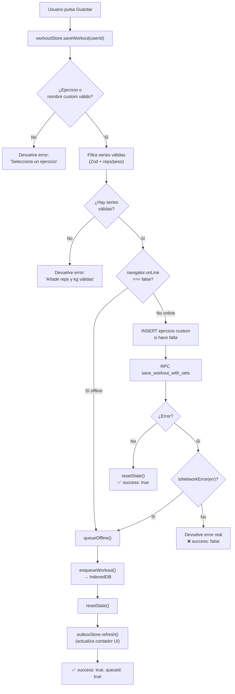
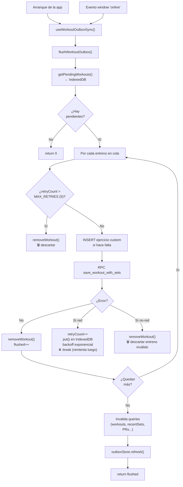
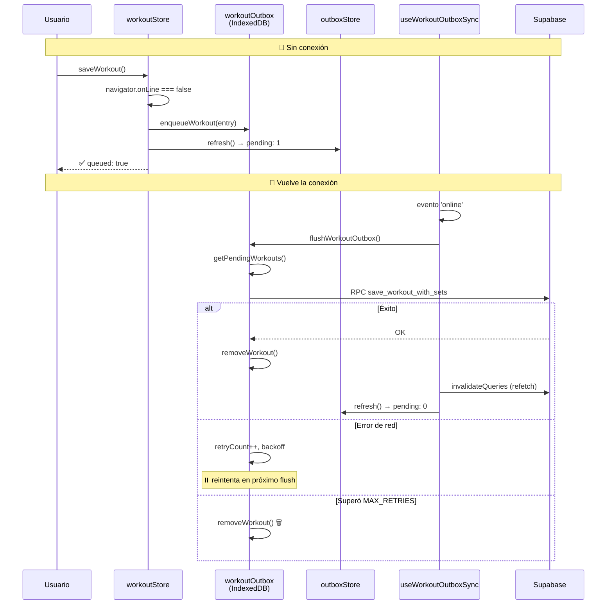

# 📋 Análisis de Lógica del Repositorio — GymLog

**Fecha:** 11 de julio de 2026
**Alcance:** Análisis completo de la lógica de negocio del repositorio
**Estado del proyecto:** 153 tests pasando ✅ · TypeScript sin errores ✅

> Este documento es un **análisis** con **posibles soluciones** propuestas para
> implementar más adelante. **No modifica ningún código fuente.**

---

## Índice

1. [Resumen ejecutivo](#1-resumen-ejecutivo)
2. [Arquitectura general](#2-arquitectura-general)
3. [Análisis de la lógica por módulo](#3-análisis-de-la-lógica-por-módulo)
4. [🔴 Bugs de corrección (con posible solución)](#4--bugs-de-corrección-con-posible-solución)
5. [🟡 Observaciones menores](#5--observaciones-menores-mejoras-opcionales)
6. [✅ Lo que está bien](#6--lo-que-está-bien-y-podría-parecer-sospechoso)
7. [Priorización recomendada](#7-priorización-recomendada)
8. [Flujo de datos offline (Outbox + Sync)](#8-flujo-de-datos-offline-outbox--sync)
9. [Auditoría de Paridad Android/iOS (Capacitor)](#9-auditoría-de-paridad-androidios-capacitor)

---

## 1. Resumen ejecutivo

**GymLog** es una aplicación de fitness construida como **PWA + Capacitor** (iOS/Android) con:

- **Frontend:** React + TypeScript + Vite
- **Estado local:** Zustand (con `persist` en localStorage)
- **Estado servidor:** TanStack Query (con persistencia offline en IndexedDB)
- **Backend:** Supabase (Auth + PostgreSQL + Edge Functions + Storage)

La arquitectura es **feature-based**, limpia y consistente. La calidad general es
**alta**. Este documento detalla la lógica principal, los **2 bugs de corrección
reales** encontrados, observaciones menores, una **posible solución** para cada
problema, y los diagramas del flujo de datos offline.

---

## 2. Arquitectura general

### 2.1. Organización por features

```
src/
├── app/                    # Bootstrap, providers, query client/persister
├── features/
│   ├── auth/               # Login, signup, OAuth Google, perfil, onboarding
│   ├── workout/            # Registro de entrenos (núcleo)
│   ├── cardio/             # Sesiones de cardio con cronómetro
│   ├── routine/            # Rutinas predefinidas + custom
│   ├── stats/              # KPIs, historial, análisis de fatiga, gráficos
│   └── wearables/          # Health Connect / HealthKit
└── shared/                 # lib/, components/ui/, hooks/, stores/, api/
```

Cada feature sigue el mismo patrón: `stores/`, `api/`, `pages/`, `components/`,
`hooks/`, `types/`. **Muy consistente y mantenible.**

### 2.2. Estrategia offline-first (destacable)

| Capa             | Mecanismo                                                | Archivo                            |
| ---------------- | -------------------------------------------------------- | ---------------------------------- |
| Entrenos offline | Outbox en IndexedDB con reintentos + backoff exponencial | `shared/lib/workoutOutbox.ts`      |
| Cache de queries | Persister de TanStack Query en IndexedDB                 | `app/queryPersister.ts`            |
| Config de cache  | `gcTime` 24h cubre el `maxAge` del persister             | `app/queryClient.ts`               |
| Sincronización   | Flush automático al arrancar y al evento `online`        | `App.tsx` (`useWorkoutOutboxSync`) |

### 2.3. Lógica pura separada de la UI (destacable)

La lógica de cálculo está aislada en funciones puras testeables, sin JSX:
`kpiCalculations.ts`, `statsData.ts`, `fatigueAnalysis.ts`, `progression.ts`,
`brzycki.ts`, `achievements.ts`.

---

## 3. Análisis de la lógica por módulo

### 3.1. Workout (núcleo) — `workoutStore.ts`

- Estado persistido en localStorage (permite reanudar un entreno tras cerrar la app).
- Validación de series con **Zod** (`SetDataSchema`): reps 1-4 chars, peso 1-6 chars,
  RPE, tipo de serie (`normal`/`dropset`/`rest_pause`/`amrap`).
- Filtrado de series válidas antes de guardar: rechaza reps ≤ 0, peso < 0, y
  peso = 0 salvo en warmup.
- Guardado vía **RPC `save_workout_with_sets`** (transacción en servidor).
- **Doble capa offline:** comprueba `navigator.onLine` antes; si falla la petición,
  `isNetworkError(err)` reintenta encolando.

**Veredicto:** Sólido. ✅

### 3.2. Cardio — `cardioStore.ts`

- Cronómetro con pausa/reanudar (`getElapsed` calcula tiempo neto restando pausas).
- Descarta sesiones < 5 segundos.
- Guard de concurrencia `syncInFlight` para evitar pushes duplicados.
- Sincronización bidireccional local ↔ remoto con marca `pendingSync`.

**Veredicto:** Buen diseño, pero contiene el **bug principal** (ver §4.1). ⚠️

### 3.3. Routine — `routineStore.ts`

- 8 rutinas predefinidas (Full Body, PPL, Hipertrofia, 5x5, Upper/Lower, 5/3/1, etc.).
- Clonado con `structuredClone` (deep clone correcto, evita mutar plantillas).
- Backup automático a Supabase cada 3 días (`checkAndBackup`).
- Merge inteligente al cargar: predefinidas + custom sin duplicar por `id`.

**Veredicto:** Correcto. ✅

### 3.4. Stats — `kpiCalculations.ts`, `statsData.ts`, `fatigueAnalysis.ts`

- **Rachas** (`calculateCurrentStreak`, `calculateMaxStreak`): usan claves
  `YYYY-MM-DD` locales. El parseo con `new Date()` es **DST-safe** (ambos lados en
  medianoche UTC).
- **Volumen semanal:** anclado a lunes (`dayOfWeek === 0 ? 6 : dayOfWeek - 1`).
- **Análisis de fatiga:** clasifica músculos en `fresh` (≤2d) / `moderate` (≤4d) /
  `needs-attention` (>4d).
- **1RM (Brzycki):** clampeado a [1, 36] reps (la fórmula se rompe más allá).

**Veredicto:** Cálculos correctos y bien testeados. ✅

### 3.5. Auth — `authStore.ts`

- Subscripción `onAuthStateChange` guardada **fuera del store** para evitar listeners
  duplicados en HMR/StrictMode.
- OAuth Google con manejo nativo (Capacitor Browser + deep links) vs. web.
- `signOut` limpia cache de Query y estado persistido.

**Veredicto:** Bien manejado. ✅

---

## 4. 🔴 Bugs de corrección (con posible solución)

### 4.1. BUG PRINCIPAL — Duplicados de sesiones de cardio

**Archivo:** `src/features/cardio/stores/cardioStore.ts` → `syncFromRemote`

**Descripción del problema:**

La red de seguridad de deduplicación compara `startedAt` como **string ISO crudo**:

```ts
const remoteStartedSet = new Set(remote.map((r) => r.startedAt));
const pending = get().sessions.filter(
  (s) =>
    s.pendingSync || (!remote.some((r) => r.id === s.id) && !remoteStartedSet.has(s.startedAt)),
);
```

El cliente genera timestamps con `new Date().toISOString()` →
`"2026-07-11T10:00:00.123Z"`, pero **Supabase (`timestamptz`) los devuelve como**
`"2026-07-11T10:00:00.123+00:00"`. Como strings, **nunca son iguales**
(`Z` ≠ `+00:00`), por lo que esta comprobación es efectivamente **código muerto**.

**Escenario de fallo concreto:**

1. En `stopSession`, el `INSERT` a Supabase **tiene éxito en el servidor**.
2. La respuesta se pierde (corte de red justo después de escribir).
3. El código entra en el `else` → marca `pendingSync = true`.
4. El siguiente `syncFromRemote` **re-inserta** la misma sesión.
5. La red de seguridad por `startedAt` falla por el mismatch `Z`/`+00:00`.
6. **Resultado: fila duplicada en la base de datos.**

**Posible solución:**

**a) Normalizar los timestamps antes de comparar** (arreglo en cliente):

```ts
// Comparar por instante (epoch ms), no por string crudo.
const remoteStartedSet = new Set(remote.map((r) => new Date(r.startedAt).getTime()));
const pending = get().sessions.filter(
  (s) =>
    s.pendingSync ||
    (!remote.some((r) => r.id === s.id) && !remoteStartedSet.has(new Date(s.startedAt).getTime())),
);
```

**b) Añadir un constraint único en la base de datos** (defensa en profundidad —
recomendado combinar con (a)):

```sql
-- Nueva migración: supabase/migrations/YYYYMMDD_cardio_unique.sql
ALTER TABLE cardio_sessions
  ADD CONSTRAINT cardio_sessions_user_started_unique
  UNIQUE (user_id, started_at);
```

Y en el `insert`, usar `upsert` con `onConflict` para que un reintento no falle:

```ts
await supabase.from('cardio_sessions').upsert({/* ... */}, { onConflict: 'user_id,started_at' });
```

> **Nota:** Antes de aplicar el constraint, hay que limpiar los duplicados existentes
> en producción, o el `ALTER TABLE` fallará.

---

### 4.2. BUG SECUNDARIO — Ejercicio custom duplicable

**Archivos:** `src/features/workout/stores/workoutStore.ts` (`saveWorkout`) y
`src/shared/lib/workoutOutbox.ts` (`flushWorkoutOutbox`)

**Descripción del problema:**

Al guardar un entreno con un ejercicio custom nuevo, primero se hace un `INSERT` a
`exercises` y luego la RPC del entreno:

```ts
if (!exerciseId && customExerciseName.trim()) {
  const { data, error } = await supabase
    .from('exercises')
    .insert({ name: customExerciseName.trim(), user_id: userId, muscle_group: customMuscleGroup })
    .select('id')
    .single();
  if (error) throw error;
  exerciseId = data.id;
}
```

Si el `INSERT` **tiene éxito en el servidor pero se pierde la respuesta**, el entreno
se re-encola con `exerciseId = null` y `customExerciseName` sigue presente. En el
siguiente flush, se **crea otro ejercicio con el mismo nombre** → ejercicios
duplicados en la biblioteca del usuario.

**Riesgo:** Bajo (crear ejercicios custom es poco frecuente), pero real.

**Posible solución:**

**a) Buscar antes de insertar** (idempotencia por nombre + usuario):

```ts
if (!exerciseId && customExerciseName.trim()) {
  const name = customExerciseName.trim();
  // Buscar existente primero (case-insensitive)
  const { data: existing } = await supabase
    .from('exercises')
    .select('id')
    .eq('user_id', userId)
    .ilike('name', name)
    .maybeSingle();

  if (existing?.id) {
    exerciseId = existing.id;
  } else {
    const { data, error } = await supabase
      .from('exercises')
      .insert({ name, user_id: userId, muscle_group: customMuscleGroup })
      .select('id')
      .single();
    if (error) throw error;
    exerciseId = data.id;
  }
}
```

**b) Constraint único `(user_id, lower(name))` + `upsert`** (defensa en profundidad):

```sql
CREATE UNIQUE INDEX exercises_user_name_unique
  ON exercises (user_id, lower(name))
  WHERE user_id IS NOT NULL;
```

> **Nota:** El arreglo debe aplicarse en **ambos** sitios
> (`workoutStore.saveWorkout` y `workoutOutbox.flushWorkoutOutbox`) ya que duplican la
> lógica. Considera extraer una función compartida
> `resolveOrCreateExercise(userId, name, muscleGroup)`.

---

## 5. 🟡 Observaciones menores (mejoras opcionales)

| #   | Observación                                                                                                                                           | Archivo            | Sugerencia                                                                                                                          |
| --- | ----------------------------------------------------------------------------------------------------------------------------------------------------- | ------------------ | ----------------------------------------------------------------------------------------------------------------------------------- |
| 1   | `isNetworkError` hace match por substring (`'fetch'`, `'timeout'`, `'network'`) → podría clasificar mal un error de app como error de red y encolarlo | `workoutOutbox.ts` | Restringir a tipos de error concretos (`TypeError` de fetch) o inspeccionar el código de estado. Riesgo mitigado por `MAX_RETRIES`. |
| 2   | `ProtectedRoute` usa `useAuthStore()` completo sin selector → re-renders innecesarios                                                                 | `App.tsx`          | `useAuthStore((s) => s.user)` + selector separado para `loading`                                                                    |
| 3   | `checkAndBackup` depende de `lastBackup` en localStorage; si se limpia el storage, no hay backup hasta la próxima ventana de 3 días                   | `routineStore.ts`  | Forzar backup en eventos clave (logout, cambios de rutina) además del temporizador                                                  |
| 4   | Tests de camino-error loguean ruido (`violates check constraint`, `insert failed`)                                                                    | `__tests__/`       | Silenciar `console.error` en esos tests con `vi.spyOn`                                                                              |
| 5   | Deep clone de rutinas con `structuredClone` — requiere entorno que lo soporte (OK en Capacitor/navegadores modernos)                                  | `routineStore.ts`  | Ninguna acción; solo documentar el requisito                                                                                        |

---

## 6. ✅ Lo que está bien (y podría parecer sospechoso)

- **Rachas DST-safe:** El parseo de claves `YYYY-MM-DD` con `new Date()` es correcto
  porque ambos operandos usan medianoche UTC. No es un bug.
- **Detección offline en dos capas:** `navigator.onLine` + `isNetworkError` es diseño
  defensivo intencionado (portales cautivos, redes móviles inestables).
- **Fallbacks legacy** en `queries.ts` (RPC → doble query con `.in()`) y
  `fetchExercises`: buena resiliencia ante deploys antiguos donde la RPC no existe.
- **Guard `syncInFlight`** en cardio: previene condiciones de carrera en navegación
  rápida.

---

## 7. Priorización recomendada

| Prioridad | Item                              | Esfuerzo                      | Impacto                    |
| --------- | --------------------------------- | ----------------------------- | -------------------------- |
| 🔴 Alta   | 4.1 — Duplicados de cardio        | Bajo (cliente) + migración DB | Alto (corrupción de datos) |
| 🟡 Media  | 4.2 — Ejercicio custom duplicable | Bajo-Medio                    | Medio (UX, poco frecuente) |
| 🟢 Baja   | 5.1-5.5 — Observaciones menores   | Variable                      | Bajo                       |

---

## 8. Flujo de datos offline (Outbox + Sync)

Esta sección documenta cómo GymLog persiste entrenos sin conexión y los sincroniza al
recuperar la red.

### 8.1. Componentes involucrados

| Componente                                               | Rol                                               | Almacenamiento              |
| -------------------------------------------------------- | ------------------------------------------------- | --------------------------- |
| `workoutStore.saveWorkout`                               | Punto de entrada al guardar un entreno            | —                           |
| `workoutOutbox` (`enqueueWorkout`, `flushWorkoutOutbox`) | Cola de entrenos pendientes con reintentos        | IndexedDB (`gymlog-outbox`) |
| `outboxStore`                                            | Contador reactivo de pendientes para la UI        | Memoria (Zustand)           |
| `useWorkoutOutboxSync` (`App.tsx`)                       | Dispara el flush al arrancar y al evento `online` | —                           |
| Supabase RPC `save_workout_with_sets`                    | Transacción de guardado en servidor               | PostgreSQL                  |

### 8.2. Diagrama de flujo — Guardar un entreno



### 8.3. Diagrama de flujo — Sincronización (flush)



### 8.4. Diagrama de secuencia — Ciclo completo offline → online



### 8.5. Notas del diseño offline

- **Backoff exponencial:** `BASE_DELAY_MS (2s) × 2^(intento-1) + jitter aleatorio`,
  hasta `MAX_RETRIES = 5`.
- **Apertura perezosa de IndexedDB:** `getDb()` no toca IndexedDB hasta el primer uso
  real (evita fallos en tests/SSR).
- **⚠️ Punto débil relacionado con el bug §4.2:** El `INSERT` de ejercicio custom
  dentro del flush no es idempotente — si la respuesta se pierde tras un insert
  exitoso, un reintento crea un ejercicio duplicado.

---

## 9. Auditoría de Paridad Android/iOS (Capacitor)

GymLog es una aplicación híbrida basada en **Capacitor** donde ambas plataformas nativas (iOS y Android) cargan el mismo bundle web compilado en `src/`. Sin embargo, existen diferencias operativas, capacidades nativas y comportamientos del WebView que pueden causar divergencias de paridad. A continuación, se detalla la auditoría estructurada de estos componentes.

### 9.1. Rutas y Navegación Híbrida

- **Definición de rutas:** Las 9 rutas principales (`/`, `/routines`, `/stats`, `/history`, `/settings`, `/cardio`, `/user-stats`, `/login`, `/auth/callback`) están declaradas y gestionadas centralizadamente con `react-router-dom` en [App.tsx](file:///c:/Users/franc/proyectos/gymlog/src/App.tsx).
- **Deep Links y Callbacks:** Configurados mediante el event listener `appUrlOpen` del plugin `@capacitor/app` en [App.tsx](file:///c:/Users/franc/proyectos/gymlog/src/App.tsx).
  - **Comportamiento:** Resuelve correctamente tanto los shortcuts locales (`com.franvi.gymlog://workout/new`, `com.franvi.gymlog://history`) como la redirección de autenticación externa de Supabase (`/auth/callback` o host `auth`) procesando el token de acceso.
- **Barra de navegación inferior:** Implementada en [Layout.tsx](file:///c:/Users/franc/proyectos/gymlog/src/app/components/Layout.tsx) utilizando componentes `<Link>` estándar.
- **Divergencias Encontradas:**
  | Severidad   | Componente                               | Divergencia                                                                                                                                                                                                                                                                                             | Fix Propuesto                                                                                                                                                                                                                                                                                                                                                                                                                                                                                                   |
  | ----------- | ---------------------------------------- | ------------------------------------------------------------------------------------------------------------------------------------------------------------------------------------------------------------------------------------------------------------------------------------------------------- | --------------------------------------------------------------------------------------------------------------------------------------------------------------------------------------------------------------------------------------------------------------------------------------------------------------------------------------------------------------------------------------------------------------------------------------------------------------------------------------------------------------- |
  | 🟢 **Baja** | Adaptación de Barras de Sistema (Insets) | En iOS, [capacitor.config.ts](file:///c:/Users/franc/proyectos/gymlog/capacitor.config.ts) utiliza `contentInset: 'never'` y confía en variables CSS estándar como `env(safe-area-inset-top)`. En Android, la barra de estado es transparente pero el WebView no siempre calcula correctamente `env()`. | **Sin acción inmediata necesaria (Validado):** [MainActivity.kt](file:///c:/Users/franc/proyectos/gymlog/android/app/src/main/java/com/franvi/gymlog/MainActivity.kt) implementa un insets listener que inyecta dinámicamente variables CSS (`--inset-top`, `--inset-bottom`, `--inset-left`, `--inset-right`) al cargar la web. El CSS de la app en [index.css](file:///c:/Users/franc/proyectos/gymlog/src/index.css) utiliza fallbacks híbridos correctos como `var(--inset-top, env(safe-area-inset-top))`. |

---

### 9.2. Plugins Nativos Duales (Paridad de Contratos)

GymLog consume dos plugins nativos personalizados: `BiometricPlugin` y `HealthBridge`.

#### A. BiometricPlugin

Consumido desde [biometric.ts](file:///c:/Users/franc/proyectos/gymlog/src/shared/lib/biometric.ts).

- **Divergencias Encontradas:**
  | Severidad    | Tipo              | Divergencia                                                                                                                                                                                                                                                                                                                                                                                                                                                                    | Fix Propuesto                                                                                                                                                                                                                                                                              |
  | ------------ | ----------------- | ------------------------------------------------------------------------------------------------------------------------------------------------------------------------------------------------------------------------------------------------------------------------------------------------------------------------------------------------------------------------------------------------------------------------------------------------------------------------------ | ------------------------------------------------------------------------------------------------------------------------------------------------------------------------------------------------------------------------------------------------------------------------------------------ |
  | 🟡 **Media** | Seguridad / Flujo | **Falta de bloqueo al arrancar en iOS:** En Android, [MainActivity.kt](file:///c:/Users/franc/proyectos/gymlog/android/app/src/main/java/com/franvi/gymlog/MainActivity.kt) lee `biometric_enabled` de SharedPreferences y, si está activo, añade un `lockView` oscuro a nivel nativo y pide biometría en el evento `onStart`. En iOS, la lógica de guardado está en UserDefaults pero **no existe la lógica equivalente de bloqueo al iniciar en SceneDelegate/AppDelegate**. | Implementar en el ciclo de vida nativo de iOS (`SceneDelegate.swift`) la comprobación de la preferencia `biometric_enabled` en `UserDefaults` y presentar un `UIViewController` de bloqueo negro con autenticación de `LAContext` de manera idéntica a Android antes de renderizar la web. |

#### B. HealthBridge (Wearables / Agregadores de Salud)

Consumido desde [healthBridge.ts](file:///c:/Users/franc/proyectos/gymlog/src/shared/lib/healthBridge.ts).

- **Divergencias Encontradas:**
  | Severidad    | Tipo             | Divergencia                                                                                                                                                                                                                                                                                                                                                                                                                                                                                                                                                                                                          | Fix Propuesto                                                                                                                                                                                                                                                                                                                                                                                                              |
  | ------------ | ---------------- | -------------------------------------------------------------------------------------------------------------------------------------------------------------------------------------------------------------------------------------------------------------------------------------------------------------------------------------------------------------------------------------------------------------------------------------------------------------------------------------------------------------------------------------------------------------------------------------------------------------------- | -------------------------------------------------------------------------------------------------------------------------------------------------------------------------------------------------------------------------------------------------------------------------------------------------------------------------------------------------------------------------------------------------------------------------- |
  | 🟡 **Media** | Pérdida de Datos | **Android no extrae distancia ni calorías en workouts:** En iOS ([HealthBridgePlugin.swift](file:///c:/Users/franc/proyectos/gymlog/ios-custom/HealthBridgePlugin.swift)), al consultar entrenamientos en `collectWorkouts`, el plugin extrae y expone los campos `distance` (convertido a km) y `calories`. En Android ([HealthBridgePlugin.kt](file:///c:/Users/franc/proyectos/gymlog/android/app/src/main/java/com/franvi/gymlog/HealthBridgePlugin.kt)), la función `readWorkouts` solo extrae `external_id`, `type`, `started_at` y `duration`, perdiendo la distancia y calorías asociadas en Health Connect. | Modificar `readWorkouts` en [HealthBridgePlugin.kt](file:///c:/Users/franc/proyectos/gymlog/android/app/src/main/java/com/franvi/gymlog/HealthBridgePlugin.kt) para que consulte los records asociados a la sesión de ejercicio (o resuelva `DistanceRecord` y `TotalCaloriesBurnedRecord` correspondientes al rango de tiempo del entreno) y los agregue al objeto de retorno `workouts` para equiparar los datos de iOS. |
  | 🟢 **Baja**  | Mapeo de Datos   | **Falta de tipo "jump_rope" en Android:** iOS mapea el tipo nativo `.jumpRope` a `"jump_rope"`. En Android, el tipo equivalente cae en la cláusula `else -> "other"` de `mapExerciseType`.                                                                                                                                                                                                                                                                                                                                                                                                                           | Añadir `ExerciseSessionRecord.EXERCISE_TYPE_JUMP_ROPE` en `mapExerciseType` dentro de [HealthBridgePlugin.kt](file:///c:/Users/franc/proyectos/gymlog/android/app/src/main/java/com/franvi/gymlog/HealthBridgePlugin.kt) y mapearlo al string `"jump_rope"`.                                                                                                                                                               |

---

### 9.3. Adaptación de Pantalla (Safe Areas & Layouts)

- **Safe Areas:** Totalmente cubiertas en CSS mediante el uso híbrido de `--inset-top` y `env()`. El scroller `<main>` principal de [Layout.tsx](file:///c:/Users/franc/proyectos/gymlog/src/app/components/Layout.tsx) aplica `pb-24` para garantizar que la barra inferior no tape el contenido.
- **Layout Fluido:** El diseño es completamente fluido. Utiliza unidades relativas (`rem`, `%`, `vh/dvh`) y una tipografía base de `15px` adecuada para pantallas móviles de ~390px, escalando correctamente a tablets sin elementos rotos.
- **Touch Targets:** Todos los elementos interactivos de la navegación inferior (`nav`) y controles de formularios tienen un tamaño mínimo o zona de impacto de $\ge 44\text{px}$, satisfaciendo las directrices de accesibilidad de Apple y Google.
- **Divergencias Encontradas:** Ninguna. ✅

---

### 9.4. Quirks del WebView Híbrido

- **Backdrop-Blur:** Implementado en [BottomSheet.tsx](file:///c:/Users/franc/proyectos/gymlog/src/shared/components/ui/BottomSheet.tsx) mediante `backdrop-filter: blur(4px)`.
- **Teclado Virtual:** No se incluye el plugin nativo `@capacitor/keyboard` en [package.json](file:///c:/Users/franc/proyectos/gymlog/package.json).
- **Divergencias Encontradas:**
  | Severidad    | Tipo               | Divergencia                                                                                                                                                                                                                                                                                                                                                     | Fix Propuesto                                                                                                                                                                                                                                                                                                                                                       |
  | ------------ | ------------------ | --------------------------------------------------------------------------------------------------------------------------------------------------------------------------------------------------------------------------------------------------------------------------------------------------------------------------------------------------------------- | ------------------------------------------------------------------------------------------------------------------------------------------------------------------------------------------------------------------------------------------------------------------------------------------------------------------------------------------------------------------- |
  | 🟡 **Media** | Rendimiento (Jank) | **Backdrop-blur lento en Android:** El uso de `backdrop-filter: blur(4px)` en el fondo de los BottomSheets causa pérdidas de frames y retrasos al animar la apertura y cierre en WebViews de Android de gama media/baja.                                                                                                                                        | Condicionar el estilo del backdrop en [BottomSheet.tsx](file:///c:/Users/franc/proyectos/gymlog/src/shared/components/ui/BottomSheet.tsx). Detectar si la plataforma es Android (usando `Capacitor.getPlatform()`) y, si es así, desactivar el blur (`backdropFilter: 'none'`) y oscurecer un poco más el fondo (`rgba(0, 0, 0, 0.6)`) para compensar el contraste. |
  | 🟡 **Media** | UX / Scroll        | **Inputs tapados por el teclado virtual:** Al no utilizar el plugin `@capacitor/keyboard`, la aplicación depende del comportamiento por defecto del motor de renderizado. En iOS, con `contentInset: 'never'`, esto puede provocar que inputs al final de la pantalla (como RPE, peso o notas) queden ocultos debajo del teclado sin redimensionar el viewport. | Instalar `@capacitor/keyboard` y configurar la propiedad `resize` en [capacitor.config.ts](file:///c:/Users/franc/proyectos/gymlog/capacitor.config.ts) (por ejemplo, a `KeyboardResize.Body` o `KeyboardResize.Ionic`) para garantizar que el WebView se encoja proporcionalmente en ambas plataformas al abrir el teclado.                                        |

---

### 9.5. Estilos Globales e Integridad de Tokens

- **Tokens de Diseño:** GymLog centraliza todas las variables de color, espaciado y radios en [tokens.css](file:///c:/Users/franc/proyectos/gymlog/src/shared/styles/tokens.css) y las consume a través del compilador Tailwind v4 en [index.css](file:///c:/Users/franc/proyectos/gymlog/src/index.css).
- **Ausencia de Hardcoding:** No se encontraron colores o espaciados definidos de manera estática o específica para una plataforma en el CSS general.
- **Integridad Multiplataforma:** Se aplica `-webkit-tap-highlight-color: transparent` y `touch-action: manipulation` de manera global en todos los elementos interactivos, logrando una experiencia fluida y eliminando el retraso al tocar en dispositivos táctiles.
- **Divergencias Encontradas:** Ninguna. ✅

---

**Fin del documento.**
